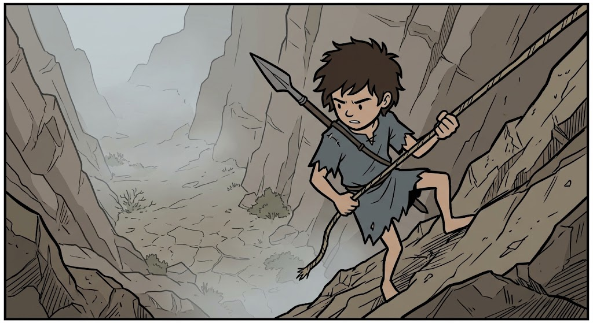
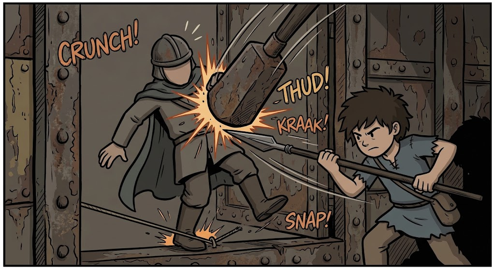
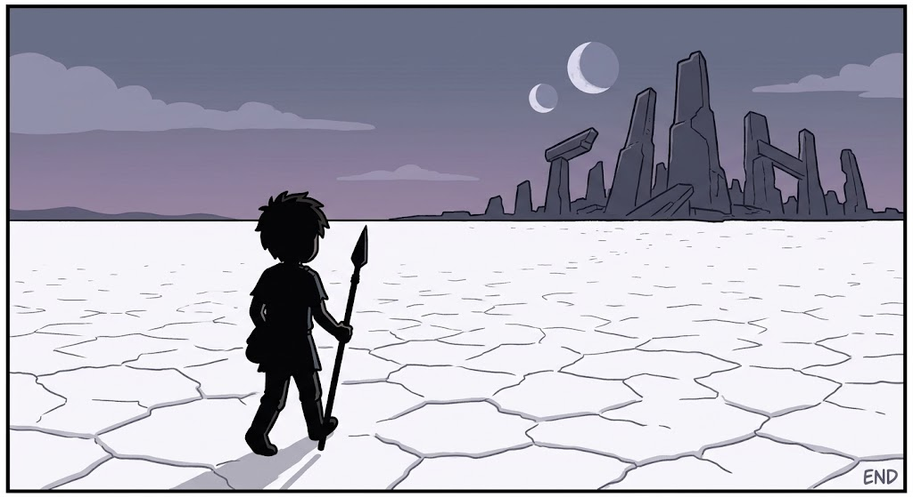
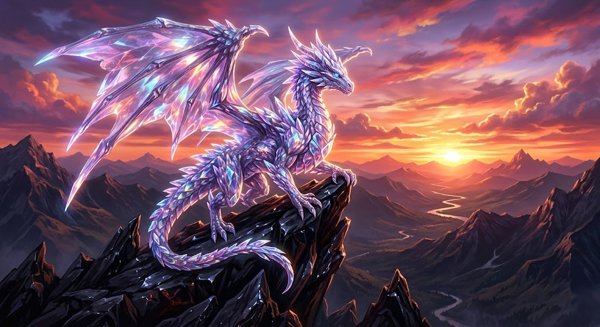

# ImageGenPiper 🚀

> **High-Performance Programmatic CLI & Chrome Extension Bridge for Gemini Web Image Generation**

ImageGenPiper bridges a local Python asynchronous orchestrator with a Chrome Manifest V3 extension, allowing you to bulk generate images on `gemini.google.com` directly using your authenticated browser session—with **zero headless bot-fingerprinting**, **multi-turn visual character continuity**, and **no API rate-limit bottlenecks**.

---

## 🖼️ Live Visual Proof & Story Continuity Showcase

ImageGenPiper maintains conversational context across sequential prompts in a single Gemini thread, preserving **character appearance**, **line weight**, **color grading**, and **environmental tone** across entire graphic narrative arcs.

### Multi-Panel Story Series: *"The Scavenger's Cache"* (10-Part Narrative Arc)

| Panel 01: The Canyon Descent | Panel 07: The Ambush | Panel 10: The Salt Flat Crossing |
| :---: | :---: | :---: |
|  |  |  |
| *Rappelling into the mist with spear* | *Tactical tripwire blind-spot strike* | *Resolute crossing under double moon* |

### Hero Single-Prompt Generation



> **Prompt:** *"A breathtaking crystal dragon perched atop an obsidian mountain at sunset, 8k digital art"*  
> **Resolution:** $1024 \times 559$ • **Format:** JPEG • **Extracted via:** Authenticated Browser Session Bridge

---

## Key Features

- 🛡️ **Zero Bot-Fingerprinting:** Piggybacks directly on your authenticated Chrome session and cookies. No Playwright, Puppeteer, or CDP needed.
- 🎨 **Multi-Turn Visual Continuity:** Runs batch prompts in a persistent Gemini thread so Imagen retains character features, art style, and color grading across sequential story panels.
- ⚡ **WebSocket Bridge (Manifest V3):** Fast, persistent JSON-RPC communication between the Python CLI and Chrome with automatic reconnection and heartbeat keepalive.
- 🎯 **Anti-Fragile DOM Architecture:** Multi-tier fallback selector engine (`SelectorMap`) with synthetic event simulation and turn-scoped isolation.
- 🔒 **Atomic Deduplication & Persistence:** In-memory hash locking prevents duplicate image writes during rapid rendering.
- 📁 **Unified Batch Manifest:** Outputs clean sequentially numbered files (`01_title_<id>.jpg`) and a single consolidated `metadata.json` manifest per batch.
- 📊 **Rich Terminal UI:** Live status tables, real-time progress updates, and benchmark throughput reporting.
- 🧪 **100% Test-Driven:** Comprehensive unit, integration, and mock test suites (23 Python tests + 7 Extension tests).

---

## Quick Start

### 1. Installation

```bash
# Clone repository and enter directory
cd ImageGenPiper

# Install Python package and dependencies
pip install -e .[dev]
```

### 2. Load the Chrome Extension

1. Open **Google Chrome** and navigate to `chrome://extensions/`.
2. Enable **Developer mode** in the top-right corner.
3. Click **Load unpacked** and select the `extension/` folder in this repository.
4. Open a tab with `https://gemini.google.com/app` and ensure you are logged into your Google account.

### 3. Verify Bridge Connection (Optional)

You can run a quick connection test to verify that the CLI and your Chrome extension communicate:

```bash
imagegenpiper test-bridge
```
*(or `python -m cli.main test-bridge`)*

---

## Generating Images

### Single Prompt

```bash
imagegenpiper run --prompt "A breathtaking crystal dragon perched atop an obsidian mountain at sunset, 8k digital art" --output-dir ./outputs
```

### Batch Story Generation via File

Create a text file (e.g. `prompts_the_scavengers_cache.txt`) with titles in `#` comments:

```text
# The Story: The Scavenger's Cache (10-part Series)
# Style: Detailed Stickman / Simple Comic Style

# Image 1: The Canyon Descent
Detailed stickman and simple comic art style, flat desaturated colors... Scene: A steep canyon wall. The boy rappelling down with guard spear...

# Image 2: The Sunken Vault
Detailed stickman and simple comic art style, flat desaturated colors... Scene: Discovering the rusted iron blast door...

# Image 3: The Broken Seal
Detailed stickman and simple comic art style, flat desaturated colors... Scene: Prying open the hatch with the triangular spear tip...
```

Run the batch generator:

```bash
imagegenpiper run --prompts-file prompts_the_scavengers_cache.txt --output-dir ./outputs/the_scavengers_cache --rate-limit 6
```

---

## CLI Reference & Options

| Option | Flag | Default | Description |
|---|---|---|---|
| `--prompt` | `-p` | `None` | Single prompt text to generate |
| `--prompts-file` | `-f` | `None` | Path to text file with prompts (one per line) |
| `--output-dir` | `-o` | `./outputs` | Directory where generated images and metadata are saved |
| `--rate-limit` | `-r` | `6.0` | Max generation requests per minute (RPM) |
| `--concurrency` | `-c` | `1` | Number of concurrent worker pipelines |
| `--timeout` | `-t` | `120` | Timeout in seconds per prompt generation |
| `--new-chat-per-prompt` | | `False` | Reset to a fresh chat before each prompt (default: False, keeps persistent multi-turn thread) |
| `--port` | | `8765` | WebSocket bridge port |

---

## Output Organization & Unified Manifest

Generated images are automatically saved with sequential index prefixes and descriptive scene slugs:

```text
outputs/the_scavengers_cache/
└── 2026-09-02/
    ├── 01_the-canyon-descent_bbe710f0.jpg
    ├── 02_the-sunken-vault_768a5483.jpg
    ├── 03_the-broken-seal_abee6c33.jpg
    ├── ...
    ├── 10_the-salt-flat-crossing_0c2b2727.jpg
    └── metadata.json
```

The unified `metadata.json` captures complete batch benchmark metrics and image details:

```json
{
  "batch_id": "prompts_the_scavengers_cache",
  "generated_at": "2026-09-02T12:33:37Z",
  "total_prompts": 10,
  "total_images_saved": 10,
  "benchmark": {
    "total_elapsed_seconds": 198.24,
    "avg_seconds_per_image": 19.82,
    "throughput_ipm": 3.03
  },
  "images": [
    {
      "index": 1,
      "title": "The Canyon Descent",
      "filename": "01_the-canyon-descent_bbe710f0.jpg",
      "path": "outputs/the_scavengers_cache/2026-09-02/01_the-canyon-descent_bbe710f0.jpg",
      "prompt": "Detailed stickman... Scene: A steep canyon wall...",
      "job_id": "bbe710f0-...",
      "mime_type": "image/jpeg",
      "file_size_bytes": 142610,
      "sha256": "a69191df8567c0e94501a46df2aa90f68abb256fd39c676741fa24492f1abb55",
      "dimensions": { "width": 1024, "height": 559 },
      "timestamp": "2026-09-02T12:30:57Z"
    }
  ]
}
```

---

## Troubleshooting & FAQ

#### 1. Why does the Chrome Extension console show `ERR_CONNECTION_REFUSED`?
This is normal when the Python CLI server is not running. The extension will automatically retry connecting with exponential backoff and will connect instantly the moment you start the CLI.

#### 2. The CLI says `Waiting for Chrome extension to connect...`
Ensure that:
1. The extension is enabled in `chrome://extensions/`.
2. Chrome is open and has a tab on `https://gemini.google.com/app`.

#### 3. How do I modify or reload the extension?
If you make changes to extension files, run:
```bash
node scripts/build_extension.js
```
Then visit `chrome://extensions/` and click the **Reload (↻)** icon on the ImageGenPiper card.

---

## Running Test Suites

```bash
# Run Python Unit and Integration Tests
pytest

# Run Extension Unit Tests
npm test
```

---

## Documentation Links

- [Architecture Overview](docs/ARCHITECTURE.md)
- [WebSocket Protocol Specification](docs/PROTOCOL.md)
- [DOM Resilience & Selector Strategy](docs/DOM_RESILIENCE.md)
- [Testing Strategy (TDD)](docs/TESTING_STRATEGY.md)
- [Development Roadmap](ROADMAP.md)
